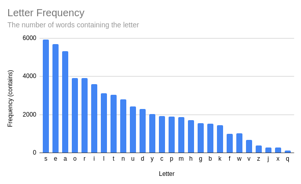
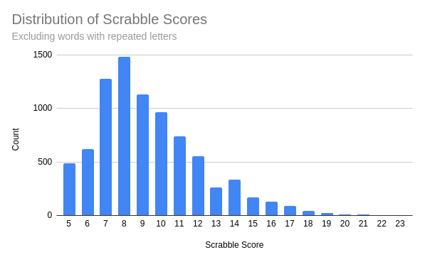
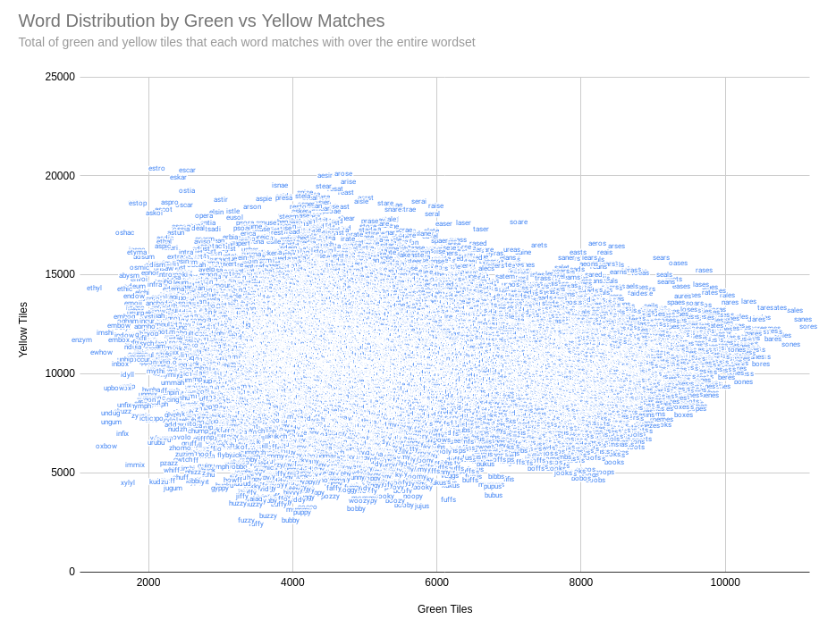

# Wordle Exploration

- [Goals](#goals)
- [Word Lists](#word-lists)
- [Letter Frequency Analyses](#letter-frequency-analyses)
  - [Letter Positions](#letter-positions)
  - [Scrabble Scores](#scrabble-scores)
- [Green and Yellow Tile Count Optimisation](#green-and-yellow-tile-count-optimisation)
- [Word Elimination](#word-elimination)

## Goals

A lot of wordle strategy seems to be about making smart choices in eliminating candidate words from the available dictionary.  The goal of this project is to explore where there are any simple heuristics we can use (simple enough to be deployed by a human at 5 minutes past midnight when the next day's puzzle turns up) that get us close to an optimal solution.

## Word Lists

Wordlists for this exercise can be found in the game's sourcecode.  There are rumoured to be 2 different lists - one of guess-candidate words, and a smaller one of solution words.  This exploration only uses the full list (much as your brain would.)  It might be that knowing the possible solutions ahead of time gives an unfair advantage over someone playing the game by hand, and in fact a lot of strategies below assume that smaller dictionaries will produce a correct solution in fewer turns.  Testing this assertion would likely require fully solving the game with both wordlists in such a way that they can be compared for efficiency.

## Letter Frequency Analyses
> *Source code: [letterfreq.py](./letterfreq.py)*  
*Output CSV: [letter-freq-contains.csv](./outputs/letter-freq-contains.csv)*

The first area of investigation is letter frequency.

Specifically:
- Which letters are the most common in 5 letter words?
- Which candidate words the most common letters?
  - Which of these words have 5 *unique* letters?

The hypothesis here is that a starting word that contains letters common to the most words will eliminate more candidates from the next round.  This rests on the assertion that a smaller dictionary will reduce the number of rounds.  There is a potential issue with this approach: when any of the letters aren't eliminated (and in particular within a threshold of exclusively yellow-matching tiles) this leaves us with a candidate dictionary for the next round that is by definition as large as possible, as it was created with the most common letters - the opposite of what we were trying to achieve.

The below table shows the number of words which contain at least one instance of each letter, and the total number of instances of each letter.  Conveniently, for the highest ranking entries, the order of highest frequency is the same.

| Letter | Words containing | Total instances |
|  :--:  |              --: |             --: |
| `s` | 5936 | 6665 |
| `e` | 5705 | 6662 |
| `a` | 5330 | 5990 |
| `o` | 3911 | 4438 |
| `r` | 3909 | 4158 |
| `i` | 3589 | 3759 |
| `l` | 3114 | 3371 |
| ... | ... | ... |

Using the top 5 letters (`s`, `e`, `a`, `o`, `r`) we can make the following words:

    ['aeros', 'arars', 'areae', 'arear', 'areas', 'arere', 'arose', 'arras',
     'arses', 'asses', 'easer', 'eases', 'erase', 'erose', 'error', 'erses',
     'esses', 'oases', 'ooses', 'raree', 'rarer', 'rares', 'raser', 'rases',
     'rasse', 'rears', 'resee', 'reses', 'roars', 'roosa', 'roose', 'rores',
     'roses', 'saree', 'saros', 'saser', 'sasse', 'seare', 'sears', 'sease',
     'seers', 'serer', 'seres', 'serra', 'serre', 'serrs', 'sessa', 'soare',
     'soars', 'soras', 'soree', 'sorer', 'sores', 'sorra']

However, many of these words contain repeated letters.  If the goal is to eliminate words by using the most common letters, we'll get most bang for our buck by ensuring the word we choose has 5 *unique* letters:

    ['aeros', 'arose', 'soare']

### Letter Positions
> *Source code: [letterpositions.py](./letterpositions.py)*  

We could attack the problem from the vertical axis, and count the frequency of each letter for each of the 5 positions in our guess:

| Position | 1st | 2nd | 3rd | 4th | 5th |
| --: | :-: | :-: | :-: | :-: | :-: |
| *Highest* | `s` | `a` | `a` | `e` | `s` |
| | `c` | `o` | `r` | `a` | `e` |
| | `b` | `e` | `i` | `t` | `y` |
| | `p` | `i` | `o` | `i` | `d` |
| | `t` | `u` | `n` | `n` | `t` |
| ... | | | | | |

Interestingly none of the three "good" candidates from plain letter frequencies (`aeros`, `arose` and `soare`) can be made with this set - for example, the first letter is rarely an `a`, and the 4th letter is rarely an `r`.

The following list of words are those that can be made from the most common 3 letters for each position:

    ['baits', 'bares', 'beats', 'beaty', 'beray', 'boats', 'boite', 'boras', 'bores', 'borts',
    'borty', 'cares', 'carte', 'carts', 'certs', 'certy', 'coate', 'coats', 'coits', 'cores',
    'corey', 'seity']

### Scrabble scores
> *Source code: [scrabble.py](./scrabble.py)*  
*Output CSV: [scrabble.csv](./outputs/scrabble.csv)*  
*Output CSV (non-repeated letters): [scrabble-unrepeated.csv](./outputs/scrabble-unrepeated.csv)*

Scrabble has an existing mechanism for ranking letters according to their commonality - it could be worth attempting to apply this to the words generated above.  The theory here is that the words with the lowest scores (5) will eliminate the largest proportion of the dictionary in the first round, assuming that most or all are non-matches.

The chart below gives the distribution of scrabble scores for the words in the wordle dictionary, excluding those with repeated letters:

As the chart shows, there are around 500 words with the lowest possible score - `aeons`, `aeros`, `aesir`, `airns`, `airts`, `aisle`, `aitus`, `alert`, `alien`, `aline`, ..., etc.  To narrow it down, we could apply the scrabble scores only to the words from the position analysis above.  Doing so gives the following ordering:

| Score | Word |
| --: | :--: |
|  7 | `baits` |
|  7 | `bares` |
|  7 | `beats` |
|  7 | `boats` |
|  7 | `boite` |
|    |  ...    |
|  7 | `coits` |
|  7 | `cores` |
|  8 | `seity` |
| 10 | `beaty` |
| 10 | `beray` |
| 10 | `borty` |
| 10 | `certy` |
| 10 | `corey` |

Curiously this has no 5-scoring words.  Recall that the list was generated using the 3 most common letters for each position.  If we extend this to the 5 most common letters, we can achieve lower scrabble scoring words:

| Score | Word |
| --: | :--: |
| 5 | `saine` |
| 5 | `saint` |
| 5 | `suint` |
| 5 | `suite` |
| 5 | `surat` |
| 5 | `tains` |
| 5 | `tares` |
| 5 | `tarns` |
| 5 | `teins` |
| 5 | `teras` |
| 5 | `terns` |
| 5 | `tians` |
| 5 | `tinas` |
|   | ...   |

Having to use less common letters to achieve a lower score may suggest that scrabble scoring is not a suitable proxy for an optimal starting word.

## Green and Yellow Tile Count Optimisation
> *Source code: [tilecount.py](./tilecount.py)*  
*Output CSV: [green-and-yellow.csv](./outputs/green-and-yellow.csv)*  
*Output CSV (non-repeated letters): [green-and-yellow-unrepeated.csv](./outputs/green-and-yellow-unrepeated.csv)*

The aim here is to find a start word that will, on average, turn as many tiles green (or failing that, yellow) as possible.  In doing this, the dictionary for the next round should be dramatically minimised as the effective word length is shortened.  This is very similar to the letter analysis above, except that whole words are ranked on their fitness, as opposed to just letters.  It suffers the opposite problem to the letter frequency approach, in that if very few tiles match in a specific puzzle then you have potentially not reduced the search space sufficiently to be able to solve the puzzle.

The following chart shows the total number of tiles that turned green when that word was being compared to every other word in the dictionary:

| Word  | Greens |
| :---: |    --: |
| `sores` | 11144 |
| `sanes` | 11077 |
| `sales` | 10961 |
| `sones` | 10910 |
| `soles` | 10794 |
| `sates` | 10729 |
| `seres` | 10676 |
| `cares` | 10668 |
| `bares` | 10655 |
| `sames` | 10624 |
| `pares` | 10605 |
| `tares` | 10561 |
| `sades` | 10503 |
| `cores` | 10501 |
| ... | ... |

Several of these words have come up as high-scoring candidates in the letter frequency analyses above, and this might not be too surprising given that the process of generating green tiles is very similar to the process of matching letters in fixed positions, as in the letter positions section.

The danger of chosing a starting word designed to optimise only green tiles is that it may penalise you in the (perhaps majority of) cases where the tiles would not have matched.  The plot below shows total number of green tiles vs the total number of yellow tiles that a word scores:

It seems reasonable (as much as any other finger-in-air heuristic) to say that fitter candidate words will be in the top-right quadrant.  As an example, if you wanted to prioritise green tiles, you might choose `tares`, to prioritise yellow you might choose `arose`, or for a balance of the two you might choose `aeros`.

We could use a kernel function of f(*green*, *yellow*) = (*n* x *green* + *yellow*) on each word to create a linear total ordering of the words for a value of *n*, which here indicates preference for green tiles.  Some example values of *n* are given below, along with the words proposed by the corresponding function:

| | *n*=0.5 | *n*=2 | *n*=10 |
| :-: | :---: | :-: | :--: |
| *Highest* | `arose` | `tares` | `tares` |
| | `aesir` | `lares` | `cares` |
| | `arise` | `rales` | `bares` |
| | `stear` | `nares` | `pares` |
| | `aster` | `rates` | `dares` |
| | `resat` | `dares` | `lares` |

## Word Elimination
